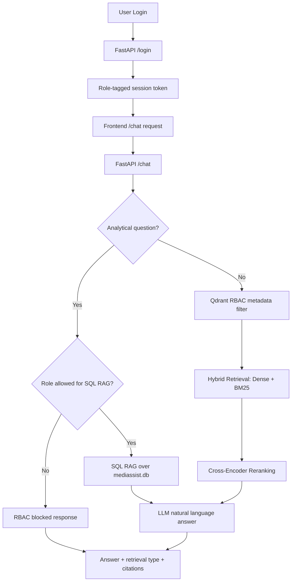

# MediBot Assignment

MediBot is a role-aware hospital assistant for MediAssist Health Network. It combines document RAG, role-based access control, hybrid retrieval, reranking, SQL RAG, a FastAPI backend, and a Next.js frontend.

## Features

- Role-based access control enforced during Qdrant retrieval with metadata filters.
- Hybrid RAG using dense semantic embeddings and sparse BM25 retrieval.
- Cross-encoder reranking before context is passed to the LLM.
- SQL RAG for analytical questions over `claims` and `maintenance_tickets`.
- FastAPI backend with login, chat, collections, and health endpoints.
- Next.js frontend with demo users, role badge, accessible collections, retrieval type labels, RBAC messages, and source citations.

## Project Structure

```text
Medibot_Assignment_Resources/
  medibot_modular/
    api.py                 # FastAPI backend
    build_index.py         # Builds the local Qdrant vector store
    chat_demo.py           # CLI test script
    config.py              # Paths, roles, model names
    document_processing.py # Docling parsing and chunking
    embeddings.py          # Dense and sparse embeddings
    hybrid_rag.py          # RBAC-filtered hybrid RAG and reranking
    llm.py                 # Groq LLM setup
    router.py              # SQL vs document RAG routing
    sql_rag.py             # SQL RAG chain
    vector_store.py        # Qdrant build/load helpers
  medibot_frontend/        # NExt.js frontend
    app/
    package.json
    next.config.mjs
  mediassist_data/         # Data to use RAG on
  my_lang_vs/              # Vectore store
  medi_assignment.ipynb    # A raw prototype using python notebook.
```

## API Key Setup

The backend uses Groq for LLM inference.

Create a `groq_key.txt` file in the parent workspace folder:

```text
your_groq_api_key_here
```

The backend checks for the key in this order:

1. `GROQ_API_KEY` environment variable
2. `groq_key.txt`
3. Manual terminal prompt

Do not commit `groq_key.txt` to GitHub.

## Backend Setup

Install the Python dependencies used by the notebook/backend in your environment. The project expects packages such as:

```text
fastapi
uvicorn
docling
transformers
sentence-transformers
langchain
langchain-classic
langchain-community
langchain-groq
langchain-huggingface
langchain-qdrant
qdrant-client
fastembed
pandas
```

Build the vector index if it does not already exist:

```bash
cd Medibot_Assignment_Resources/medibot_modular
python build_index.py
```
## CLI Chat Demo

You can test the RAG pipeline from the terminal without the frontend:

```bash
cd Medibot_Assignment_Resources/medibot_modular
python chat_demo.py "What is pathological hemoglobin level?" --role doctor
```

Useful options:

```bash
python chat_demo.py "How many tickets are in each category?" --role admin --debug-sql
python chat_demo.py "What is the process for filling claims?" --role billing_executive --rerank
python chat_demo.py "Show me equipment calibration steps" --role technician --k 3
```
## Backend

Start the FastAPI backend:

```bash
cd Medibot_Assignment_Resources/medibot_modular
uvicorn api:app --reload --port 8000
```

Useful backend URLs:

```text
http://localhost:8000/
http://localhost:8000/health
http://localhost:8000/docs
```

Example: Login with
```
curl -X POST http://localhost:8000/login \
  -H "Content-Type: application/json" \
  -d '{"username":"dr.mehta","password":"doctor123"}'
```
pass the token and query:
```
curl -X POST http://localhost:8000/chat \
  -H "Content-Type: application/json" \
  -H "Authorization: Bearer YOUR_TOKEN_HERE" \
  -d '{"question":"What is pathological hemoglobin level?","k":3}'
```

## Frontend Setup

Start the backend first, then run the frontend:

```bash
cd Medibot_Assignment_Resources/medibot_frontend
npm install
npm run dev
```

Open:

```text
http://localhost:3000
```

The frontend calls `/api/*`, and `next.config.mjs` rewrites those requests to the FastAPI backend at `http://localhost:8000/*`.

## Demo Credentials

| Username | Password | Role | Accessible Collections |
| --- | --- | --- | --- |
| `dr.mehta` | `doctor123` | `doctor` | `general`, `clinical`, `nursing` |
| `nurse.priya` | `nurse123` | `nurse` | `general`, `nursing` |
| `billing.ravi` | `billing123` | `billing_executive` | `general`, `billing` |
| `tech.anand` | `tech123` | `technician` | `general`, `equipment` |
| `admin.sys` | `admin123` | `admin` | all collections |

## API Endpoints

| Method | Endpoint | Description |
| --- | --- | --- |
| `POST` | `/login` | Accepts username and password, returns a role-tagged session token. |
| `POST` | `/chat` | Main RAG endpoint. Applies role access, routes to Hybrid RAG or SQL RAG, and returns answer plus sources. |
| `GET` | `/collections/{role}` | Returns document collections accessible to the role. |
| `GET` | `/health` | Health check. |

## Architecture Diagram



## Demo 
Valid Query


RBAC


see  `screenshots/` for more RBAC examples.
